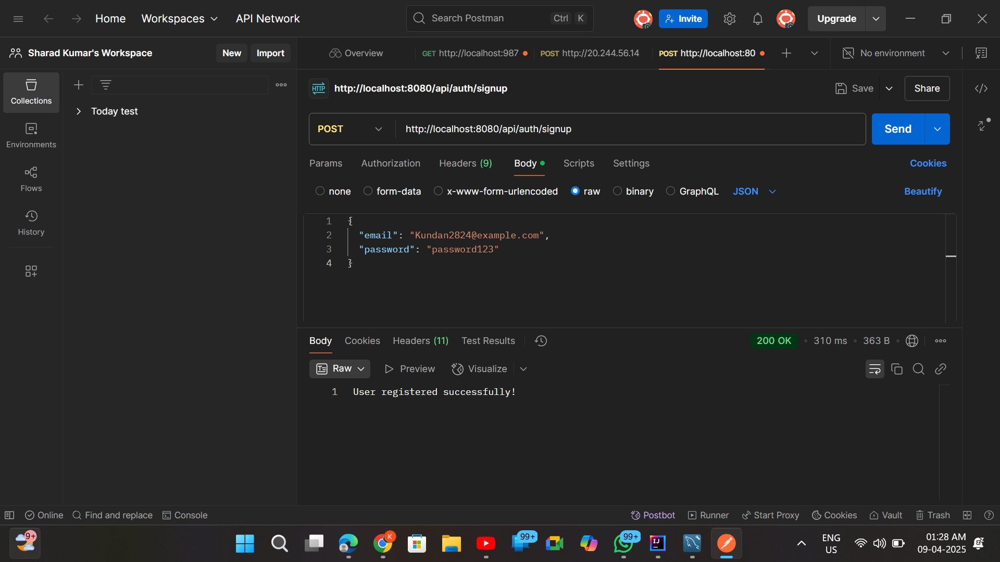
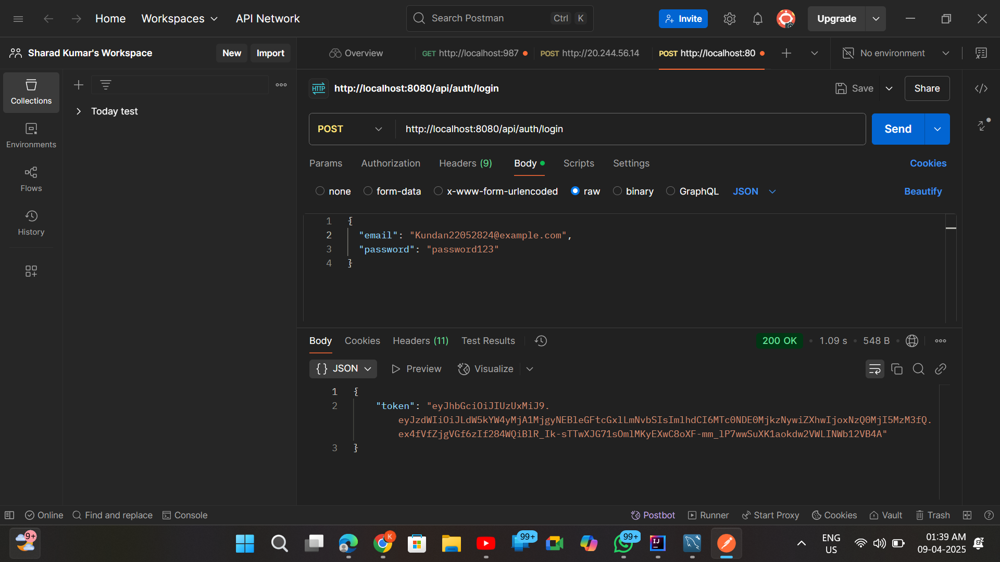
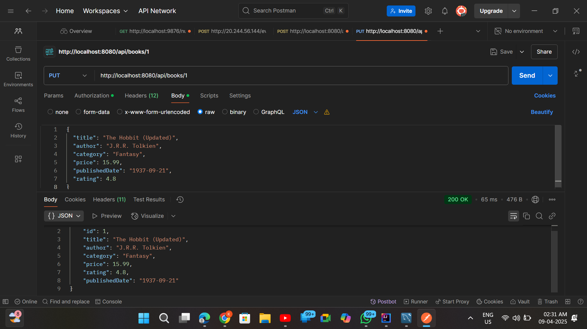
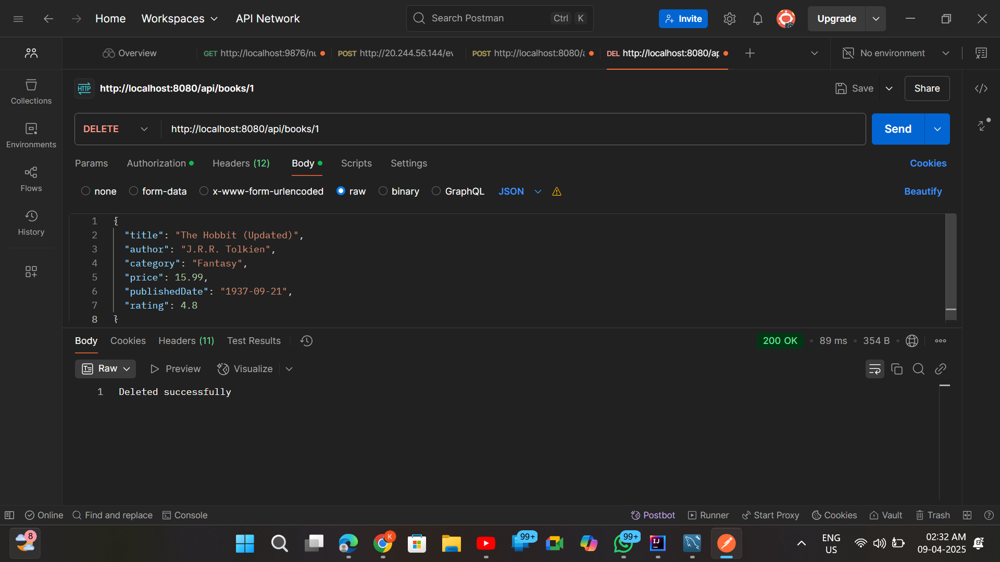
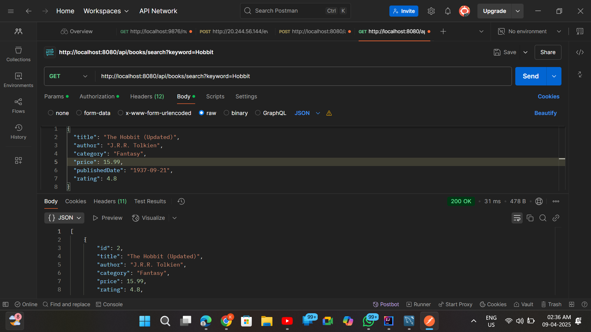
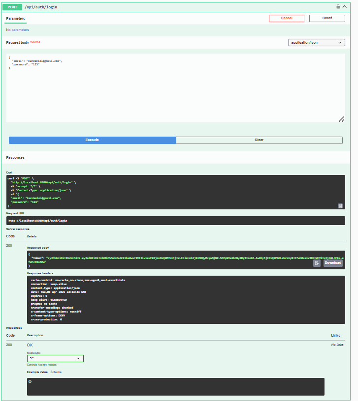

# 📚 Bookstore RESTful API

A robust and modular RESTful API for a Bookstore application, built using **Java Spring Boot** as part of a backend developer assignment. This API enables book and user management with features like JWT authentication, CRUD operations, filtering, search, pagination, and interactive Swagger documentation.

---

## 🚀 Tech Stack

- **Language:** Java 17+
- **Framework:** Spring Boot
- **Database:** MySQL
- **ORM:** JPA/Hibernate
- **Authentication:** JWT (JSON Web Tokens)
- **Documentation:** Swagger / OpenAPI (Springdoc)
- **Dependencies:** Lombok, Spring Security, Spring Data JPA, MySQL Driver

---

## 📷 Postman / Swagger Screenshots

#### 🔐 Signup


#### 🔐 Login


#### 📖 Get Book By ID


#### 🗑️ Delete Book


#### 🔍 Search Book


#### ⚠️ Exception Handling (Invalid Book ID)


#### 📑 Swagger UI


#### 🕵️ Other Screens
  
  


## ✅ Features

### 🔐 User Authentication
- Signup & Login with JWT-based authentication.
- Secure protected routes using tokens.

### 📖 Books API
- Full CRUD for books.
- Filter books by `author`, `category`, and `rating`.
- Search books by `title` (partial match supported).

### 🛡️ Error Handling
- Proper HTTP status codes (`400`, `401`, `404`, etc.)
- Input validation for all endpoints.

### ✨ Bonus Features
- **Pagination**: Paginated book listing with sorting support.
- **Swagger UI**: Live API docs at `/swagger-ui.html`.
- **Clean Architecture**: Services, controllers, DTOs, repositories, and security are modularly separated.

---

## ⚙️ Prerequisites

- Java 17+
- MySQL installed and running
- Maven installed
- Postman (optional, for testing with screenshots)

---

## 🛠️ Setup Instructions

### 1. Clone the Repository

```bash
git clone <repository-url>
cd bookstore
```

### 2. Configure MySQL Database

Create a database:

```sql
CREATE DATABASE bookstore_db;
```

Update `src/main/resources/application.properties`:

```properties
spring.datasource.url=jdbc:mysql://localhost:3306/bookstore_db
spring.datasource.username=<your-username>
spring.datasource.password=<your-password>
```

### 3. Build & Run the Application

```bash
mvn clean install
mvn spring-boot:run
```

> App starts at: `http://localhost:8080`

---

## 📘 Access Swagger UI

Navigate to:

```
http://localhost:8080/swagger-ui.html
```

Explore and test endpoints interactively!

---

## 📡 API Endpoints

### 🔐 Authentication

#### 1. **User Signup**
- **POST** `/api/auth/signup`

```json
{
  "email": "user@example.com",
  "password": "password123"
}
```

#### 2. **User Login**
- **POST** `/api/auth/login`

```json
{
  "email": "user@example.com",
  "password": "password123"
}
```

> ✅ Response includes a `JWT Token` to use as `Authorization: Bearer <token>`

---

### 📘 Books API (All Protected Routes)

#### 3. **Create a Book**
- **POST** `/api/books`

```json
{
  "title": "The Great Gatsby",
  "author": "F. Scott Fitzgerald",
  "category": "Fiction",
  "price": 10.99,
  "rating": 4.5,
  "publishedDate": "1925-04-10"
}
```

#### 4. **Get All Books**
- **GET** `/api/books`

#### 5. **Get Book by ID**
- **GET** `/api/books/{id}`

#### 6. **Update Book**
- **PUT** `/api/books/{id}`

#### 7. **Delete Book**
- **DELETE** `/api/books/{id}`

#### 8. **Filter Books**
- **GET** `/api/books/filter?author=<author>&category=<category>&rating=<rating>`

Example:
```
/api/books/filter?author=Fitzgerald&category=Fiction&rating=4
```

#### 9. **Search Books by Title**
- **GET** `/api/books/search?keyword=<keyword>`

Example:
```
/api/books/search?keyword=Gatsby
```

#### 10. **Paginated Books**
- **GET** `/api/books/paginated?page=<page>&size=<size>&sortBy=<field>`

Example:
```
/api/books/paginated?page=0&size=5&sortBy=price
```

---

## 📷 Postman Screenshots

Located in the `screenshots/` folder:
- `signup.png` – User signup
- `login.png` – User login (JWT)
- `create-book.png` – Book creation
- `get-all-books.png` – Fetch all books
- `filter-books.png` – Filter books

---

## 📌 Assumptions

- All book-related APIs require JWT authentication.
- Rating must be a value between 0 and 5.
- Pagination defaults: `page=0`, `size=5`, `sortBy=price`.
- MySQL is the default DB (adjustable in `application.properties`).

---

## ✨ Enhancements

- Swagger UI for easy testing and understanding.
- Paginated + sorted responses for large datasets.
- Flexible filtering with custom repository queries.

---

## 🧠 Project Structure

```
bookstore/
├── src/
│   ├── main/
│   │   ├── java/com/bookstore/bookstore/
│   │   │   ├── controller/     # REST Controllers
│   │   │   ├── dto/            # DTOs
│   │   │   ├── entity/         # Entities
│   │   │   ├── repository/     # JPA Repositories
│   │   │   ├── security/       # JWT & Security Config
│   │   │   └── service/        # Business Logic
│   └── resources/
│       └── application.properties
└── pom.xml
```

---

## 🧪 How to Test

- Start the app.
- Use Postman or Swagger UI to hit the endpoints.
- Refer to screenshots for sample requests.

---

## 📤 Submission

- **GitHub**: Share the public repo URL
- **ZIP**: Or package and upload the project directory

---

> Built with ❤️ for learning, growth, and backend excellence.
